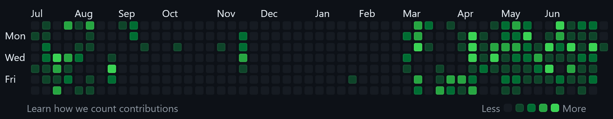

School felt like a slog. Lectures left me zoned out, the material a blur of words that never quite clicked. While other kids seemed to grasp concepts easily, I spent most classes lost in a fog of daydreams, my mind a million miles away crafting fantastical stories. Passing was the only goal, the bare minimum to keep my parents off my back and maintain some show of normality. My grades consistently suffered, reflecting my lack of interest. That's when my mom changed everything.

## The Gentle Nudge I Needed

One day, my mom asked about my goals and dreams, and I told her about my passion for programming. She delivered a straightforward message: "If you want to become a programmer, why waste your time? It's time to start now."

Her words struck a chord. Simple but made me re-evaluate what I wanted to achieve and pointed me in the right direction. I had been avoiding the hard work and discipline required to pursue my dreams. My mom's gentle nudge made me re-evaluate my priorities and consider the future I wanted to create for myself. She wasn't just giving advice; she was offering a lifeline to pull me out of my comfort zone and push me toward my dream. From that day forward, I made a conscious decision to change my habits.

## The Journey Begins

My journey was anything but straightforward. Uncertain of the specific path, I only knew that I wanted to learn programming without a clear idea of what I wanted to develop. This created a sense of overwhelm. I struggled a lot, but I always managed to find my way back.

### Finding My Path

I started learning C++ and became hooked from the very beginning. I spent countless hours learning to code. Initially, I used YouTube tutorials and [freeCodeCamp](https://www.freecodecamp.org/), but I found the videos to be too fast paced and lacking in clear explanations of the concepts, which was challenging as a beginner. Then, I discovered [Learn C++](https://www.learncpp.com/) and found that I thrived with text based tutorials. It explained the concepts behind the syntax and how it worked, which helped me understand the language better.

As a result of finishing the C++, tutorial I was unsure what to do next and what to develop. So, I started exploring, and that's when I was introduced to external libraries. I began learning about [SFML](https://www.sfml-dev.org/) and started developing games. I started with a simple snake game, creating my own assets using pixel art. It was my first program with graphics, and it's available on [GitHub](https://github.com/alexndrho/SFML-SNAKE/).

Afterward, I wasn't sure what to do next. So, I decided to learn about game engines because I had started exploring game development. First, I tried Unity and Godot, and I learned the ropes of creating a 3D model. My first model was a donut built with Blender, which I learned from a YouTube video. However, I realized that building 3D models wasn't that easy, so I shifted gears and went back to 2D games. I envisioned creating something similar to Pokémon graphics and tried to learn pixel art. Along the way, I also studied color theory, which significantly improved the mood of my artwork. I made a bunch of art and got interested in making art in general, so it became my side hobby. I created my own [Instagram account](https://www.instagram.com/doubtfulalex/) to showcase my works, highlighting my progress as an artist from basic pieces to more complex compositions. However, I started to realize that I was straying from my programming goals. I really wanted to become a programmer, but I realized that my progress had stalled. That's when I decided to refocus on programming.

After going through a difficult time trying to keep up with the overwhelming amount of information I needed to learn on my own, I decided to take a break. I spent a few months searching for a clear path to get back on track. Eventually, I found a free online curriculum called [The Odin Project](https://www.theodinproject.com/), which reignited my passion and motivated me to pursue web development. Having a structured curriculum to follow made a world of difference.

### Transition to Web Development

I dove headfirst into learning HTML, CSS, and Javascript. Coming from the C family languages, Javascript felt like a whole new world. It was my first time working with a dynamically typed language, and everything felt confusing especially the implicit behavior. Unlike C++, where variables have a strict data type declared upfront, Javascript allows variables to hold different types of data at different times. This flexibility can be powerful, but it can also lead to unexpected results.

For example, in C++, adding a number and a string wouldn't work. You'd get a compilation error. But in Javascript, it implicitly coerces the string into a number, potentially leading to nonsensical results. This implicit type conversion can be a real head scratcher for beginners.

The curriculum's well structured format and worth of external resources proved invaluable in helping me grasp these concepts. While the fundamentals were solid, I found myself bogged down by the repetitiveness of the challenges. Each topic seemed to follow the same pattern: learn the basics, then complete a time consuming project that felt disconnected from the lesson. That's when I decided to leverage the curriculum as a reference and forge my own path.

I stumbled upon [Developer Roadmaps](https://roadmap.sh/). This resource became a game changer, providing a clear roadmap for web development and helping me identify any potential gaps in my knowledge. Having a better idea of where to go, I set my sights on learning React, especially since it is an in-demand framework in the industry.

Unfortunately, in a fit of perfectionism, I deleted my web development and React projects from GitHub. They simply didn't meet my own high standards.

### The Struggle and the Break

The constant struggle to understand new concepts coupled with the feeling of making slow progress, eventually led to burnout. Taking a break from coding felt necessary, but with each passing month, a creeping sense of disconnection from programming grew. This became overwhelming and left me feeling burned out, making it difficult to get back on track. Every attempt to return felt exhausting, even just getting started.

Nearly half a year passed without touching the code. My once vibrant GitHub profile, now filled with empty green squares, became a reminder of my stagnation. Initially, I'd placed my trust in the school curriculum, believing it would be enough to provide me with the skills I needed to become a programmer. However, reality soon set in. The classroom environment just wasn't providing the depth or the hands on I desired.

Thankfully, during this discouraging time, I received support that helped me regain the motivation I had lost. It wasn't easy getting back on track after a long break. The months away meant that some of the knowledge I had gained had faded, and I had to relearn some concepts.

## Beyond the Code

Developing Web applications becomes fun, fun as I get playing games. Rather than learning to code like routine work. It isn't all about mastering the syntax or understanding the concepts. It's something like an art, where you can express your creativity, and how you solve the problem creating your own solution. At its core coding is all about problem solving. The constant problem was analyzing the situation, breaking down the problem into smaller pieces, and finding the best solution. The skills I've developed along the way have made me a better problem solver, a more patient learner, and a more creative thinker.

The coding community has been a huge source of support. I've met so many amazing people who have helped me along the way. The amount of developers who are willing to share their knowledge and build each other up for free in the community is incredible. The idea of open sourcing was a foreign concept to me at first, like I was like "Why would you give away your code for free?" But now I understand that without it the web wouldn't be what it is today.
